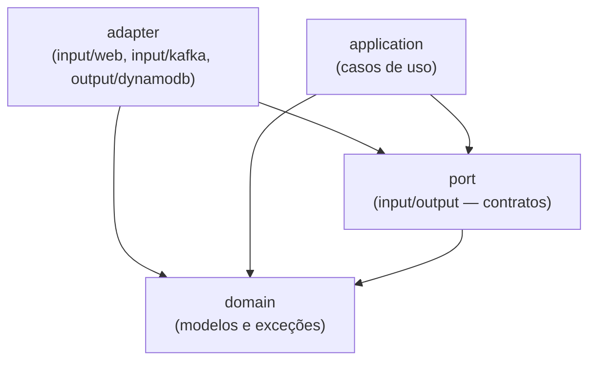
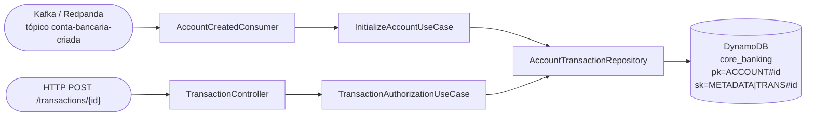

# core-banking-test

[](../../actions/workflows/build.yml)
[](../../actions/workflows/test.yml)
[](../../actions/workflows/docker.yml)
[](../../actions/workflows/codeql.yml)

Autorizador de transações com duas entradas: **Kafka** (`conta-bancaria-criada` → cria conta com saldo zero) e **REST** (`POST /transactions/{id}` → crédito/débito) sobre **DynamoDB** (`core_banking`).

## Sumário

- [Stack](#stack)
- [Arquitetura](#arquitetura)
- [Estrutura de pastas](#estrutura-de-pastas)
- [Endpoints da API](#endpoints-da-api)
- [Mensageria Kafka](#mensageria-kafka)
- [Imagens Docker utilizadas](#imagens-docker-utilizadas)
- [Variáveis de ambiente](#variáveis-de-ambiente)
- [Como rodar](#como-rodar)
- [Comandos do Makefile](#comandos-do-makefile)
- [Testes](#testes)
- [Cobertura de testes](#cobertura-de-testes)

## Stack

| Categoria | Tecnologia |
|-|-|
| Linguagem | Kotlin 2.3.21 |
| Runtime | Java 21 (Eclipse Temurin) |
| Framework | Spring Boot 4.1.0 (Spring Framework 7) |
| Build | Gradle 9.5.1 (Kotlin DSL) |
| Web | Spring MVC (`spring-boot-starter-webmvc`) + Validation |
| Serialização JSON | Jackson 3 (`tools.jackson`, incluindo módulo Kotlin) |
| Banco de dados | Amazon DynamoDB (via AWS SDK for Java v2) |
| Mensageria | Kafka (protocolo) via Spring Kafka, broker real = Redpanda |
| Observabilidade | Spring Actuator (`/actuator/health`, `/actuator/prometheus`), Micrometer, Logstash JSON |
| Testes | JUnit 5, Mockito, Konsist (teste de arquitetura), MockMvc |
| Cobertura | JaCoCo (gate mínimo de 90% de instruções) |
| Containers | Docker + Docker Compose |

## Arquitetura

Hexagonal: `domain` não depende de framework; `port` define contratos; `application` orquestra; `adapter` isola I/O. Dependência sempre em direção ao domínio (validado por `HexagonalArchitectureTest` com Konsist).



### Camadas

#### 1. `domain` — núcleo
- `domain/model/Amount.kt`, `TransactionRequest.kt`, `TransactionResponse.kt`, `MoneyMinor.kt` (String ↔ Long centavos, sem BigDecimal)
- `domain/model/Currency.kt` (`BRL`), `OperationType.kt` (`CREDIT/DEBIT`), `TransactionStatus.kt` (`SUCCEEDED/FAILED`)
- `domain/exception/*` — `InvalidAmountException` (400), `AccountNotFoundException` (404), `CurrencyMismatchException` (422), `IdempotencyConflictException` (409)

#### 2. `port` — contratos
- `port/input/TransactionAuthorizationUseCase` — `createTransaction(transactionId, TransactionRequest): TransactionAuthorizationResponse`
- `port/input/InitializeAccountUseCase` — `initialize(accountId, owner, createdAtMicros, status)`
- `port/output/AccountRepository` — `save(transactionId, request): Pair<TransactionResponse, Long>` e `createIfAbsent(...)`

#### 3. `application` — casos de uso
- `TransactionAuthorizationService` — delega ao `AccountRepository` e monta `AccountTransactionResponse` com `Balance`
- `InitializeAccountService` — filtra `status != ENABLED` e cria conta via `createIfAbsent`

#### 4. `adapter`
- `adapter/input/web/TransactionController` — `POST /transactions/{transactionId}`
- `adapter/input/web/ApiExceptionHandler` — mapeia exceções para JSON simples `{message, field}` com `400/404/409/422/503`
- `adapter/input/kafka/AccountCreatedConsumer` — `@KafkaListener` em `conta-bancaria-criada`, ignora mensagens legadas `template`
- `adapter/output/dynamodb/AccountTransactionRepository` — `TransactWriteItems` (Update saldo + Put transação), `attribute_not_exists` para idempotência, `balance >= :need` para débito
- `adapter/output/dynamodb/config/DynamoDbConfig` — `DynamoDbClient`

### Fluxo de dados



## Estrutura de pastas

```
src/main/kotlin/br/com/itau/challenge/
├── Application.kt
└── hello/
    ├── domain/                             # modelos, MoneyMinor, exceções
    ├── port/{input,output}/                # contratos
    ├── application/                        # casos de uso
    └── adapter/
        ├── input/{web,kafka}/              # driving adapters
        └── output/dynamodb/                # driven adapters

src/test/kotlin/                            # testes unitários (sem infra)
src/integrationTest/kotlin/                 # testes de integração (infra real via Docker)

infra/                                      # seeds de infraestrutura local (Docker Compose)
├── dynamodb/                               # script + seed do DynamoDB (tabela core_banking PK/SK)
└── redpanda/                               # script + seed do tópico Kafka

http/                                       # arquivos .http para chamar a API manualmente
```

## Endpoints da API

### `POST /transactions/{transactionId}`

Idempotente: `transactionId` vem do chamador na URL. Mesmo `id` + mesmo payload → `200` com resultado original e saldo atual; mesmo `id` + payload diferente → `409`.

**Request:**
```json
{
  "account_id": "9557bb91-40db-419e-ae97-36b5ae9e2f0a",
  "type": "CREDIT",
  "amount": { "value": "10.00", "currency": "BRL" }
}
```
- `account_id` UUID, `type` `CREDIT|DEBIT`, `amount.value` String `>0` até 2 casas, `amount.currency` `BRL` (divergência → `422`)

**Response `200` sucesso:**
```json
{
  "transaction": { "id": "f3716627-4d01-4ed2-a636-02d402d0168a", "type": "CREDIT", "amount": {"value":"10.00","currency":"BRL"}, "status":"SUCCEEDED", "timestamp":"2026-09-05T02:29:50Z" },
  "account": { "id":"9557bb91-40db-419e-ae97-36b5ae9e2f0a", "balance":{"amount":1000,"currency":"BRL"} }
}
```
- `status` `SUCCEEDED` ou `FAILED` (saldo insuficiente → `200 FAILED`, saldo inalterado)
- `422` moeda divergente, `404` conta inexistente, `409` idempotência com payload diferente, `400` valor inválido, `503` Dynamo temporariamente fora (`Retry-After:2`)
- Erros sempre JSON simples: `{"message":"...","field":null}` (sem stacktrace)

**curl de teste:**
```bash
TX_ID=$(uuidgen | tr '[:upper:]' '[:lower:]')
curl -X POST "http://localhost:8080/transactions/$TX_ID" \
  -H 'Content-Type: application/json' \
  -d '{"account_id":"9557bb91-40db-419e-ae97-36b5ae9e2f0a","type":"CREDIT","amount":{"value":"10.00","currency":"BRL"}}'

# débito que deve falhar por saldo (200 com FAILED)
curl -X POST "http://localhost:8080/transactions/$(uuidgen)" \
  -H 'Content-Type: application/json' \
  -d '{"account_id":"9557bb91-40db-419e-ae97-36b5ae9e2f0a","type":"DEBIT","amount":{"value":"200.00","currency":"BRL"}}'

# idempotência — mesmo TX_ID payload diferente → 409
curl -X POST "http://localhost:8080/transactions/$TX_ID" \
  -H 'Content-Type: application/json' \
  -d '{"account_id":"9557bb91-40db-419e-ae97-36b5ae9e2f0a","type":"DEBIT","amount":{"value":"10.00","currency":"BRL"}}'
```

Exemplos em `http/` (REST Client / IntelliJ / `make http`).

## Mensageria Kafka

### Tópico `conta-bancaria-criada` (entrada)

Consumer `AccountCreatedConsumer` valida `status == ENABLED` e persiste conta com `balance 0` via `PutItem attribute_not_exists(#pk)`. Mensagens legadas com `template` são ignoradas (log `DEBUG`).

**Schema (JSON):**
```json
{"account": {"id":"5b19...","owner":"315e...","created_at":1634874339000000,"status":"ENABLED"}}
```
- `created_at` microssegundos desde epoch

**Como publicar:**
- Redpanda Console `http://localhost:8081` → `conta-bancaria-criada` → Produce
- `docker compose run --rm --entrypoint /bin/bash redpanda-seed /redpanda-seed/produce-accounts-events.sh conta-bancaria-criada 5`
- `make kafka-produce-accounts-events TOPIC=conta-bancaria-criada COUNT=10`

## Imagens Docker utilizadas

| Serviço | Imagem | Finalidade |
|-|-|-|
| `app` | build local (`eclipse-temurin:21-jdk` → `eclipse-temurin:21-jre`) | aplicação |
| `dynamodb` | `amazon/dynamodb-local:3.3.0` | DynamoDB local in-memory |
| `dynamodb-seed` | `amazon/aws-cli:2.36.8` | cria tabela `core_banking` (`pk`/`sk`) |
| `dynamodb-admin` | `aaronshaf/dynamodb-admin:5.3.4` | console `http://localhost:8001` |
| `redpanda` | `docker.redpanda.com/redpandadata/redpanda:v26.1.14` | broker Kafka KRaft |
| `redpanda-seed` | `docker.redpanda.com/redpandadata/redpanda:v26.1.14` | config + cria tópico `conta-bancaria-criada` |
| `redpanda-console` | `docker.redpanda.com/redpandadata/console:v3.9.0` | console `http://localhost:8081` |

> Imagens com versão fixa, sem `latest`.

## Variáveis de ambiente

| Variável | Padrão (local) | Descrição |
|-|-|-|
| `DYNAMODB_ENDPOINT` | `http://localhost:8000` | endpoint DynamoDB |
| `DYNAMODB_REGION` | `us-east-1` | região fake |
| `DYNAMODB_TABLE` | `core_banking` | tabela (`pk`/`sk`) |
| `KAFKA_BOOTSTRAP_SERVERS` | `localhost:19092` | broker |
| `KAFKA_CONSUMER_GROUP_ID` | `core-banking-consumer` | group id |
| `ACCOUNT_CREATED_TOPIC` | `conta-bancaria-criada` | tópico conta |

Todas têm default em `application.yaml` e são sobrescritas no `docker-compose.yml`.

## Como rodar

Pré-requisito: **Docker** + **make** (WSL2 no Windows).

```bash
make up      # app + DynamoDB + Redpanda + seeds
make logs    # logs da app (JSON)
curl "http://localhost:8080/actuator/health" # UP
# crie uma conta via Kafka e teste o endpoint (ver curl acima)
make stop
```

Consoles: `http://localhost:8080` (app), `http://localhost:8001` (DynamoDB Admin), `http://localhost:8081` (Redpanda Console), `http://localhost:8080/actuator/prometheus` (métricas `transactions_authorized_total{status}`), `/actuator/health`.

### Loop rápido via IDE

```bash
make db-up      # só DynamoDB
make kafka-up   # só Redpanda
# aguarde seeds (make logs), rode Application.kt ou ./gradlew bootRun
```

### Solução de problemas

- **Primeiro `make up` lento:** baixa 5 imagens, acompanhe `make logs`.
- **Porta em uso (8080/8000/8001/8081/19092):** libere a porta ou pare outra stack.
- **Travou:** `make clean-containers` remove tudo.

## Comandos do Makefile

### Aplicação

| Comando | Descrição |
|-|-|
| `make build` | build imagem runtime |
| `make run` | sobe em foreground |
| `make up` | sobe em background |
| `make logs` | `docker compose logs -f` |
| `make stop` | `docker compose down` |
| `make http` | chama `.http` via Node |

### DynamoDB

| Comando | Descrição |
|-|-|
| `make db-up` | sobe DynamoDB + seed `core_banking` |
| `make db-seed` | re-roda seed |
| `make db-scan` | `scan` da tabela |
| `make db-down` | para Dynamo |

### Kafka / Redpanda

> `auto_create_topics_enabled=false` via `infra/redpanda/config.sh`, tópicos precisam ser criados explicitamente.

| Comando | Descrição |
|-|-|
| `make kafka-up` | sobe Redpanda + seed `conta-bancaria-criada` |
| `make kafka-seed` | re-roda seed |
| `make kafka-topic-create NAME=x [PARTITIONS=3]` | cria tópico |
| `make kafka-produce-accounts-events TOPIC=x [COUNT=50]` | produz `{"account":{...}}` |
| `make kafka-produce-transactions-events TOPIC=x [COUNT=50]` | produz `{"transaction":{...}}` |
| `make kafka-consume TOPIC=x` | consome (timeout 5s) |
| `make kafka-down` | para Redpanda |

### Testes

| Comando | Descrição |
|-|-|
| `make test` | `./gradlew check` (unit + JaCoCo 90%) em container |
| `make integration-test` | sobe infra + `./gradlew integrationTest` |

### Limpeza

| Comando | Descrição |
|-|-|
| `make clean-containers` | remove containers órfãos |
| `make clean` | remove imagens |

## Testes

### `src/test` — unitários (`./gradlew test`)
Sem infra: fakes/mocks para `port`, `MockMvc` para `TransactionController`, `Konsist` para arquitetura.

### `src/integrationTest` — integração (`./gradlew integrationTest`)
Contra Dynamo/Redpanda reais (`make db-up` + `make kafka-up`).

## Cobertura de testes

JaCoCo 90% de instruções, `build/reports/jacoco/test/html/index.html` após `./gradlew test`. Veredito impresso no log do Gradle.
